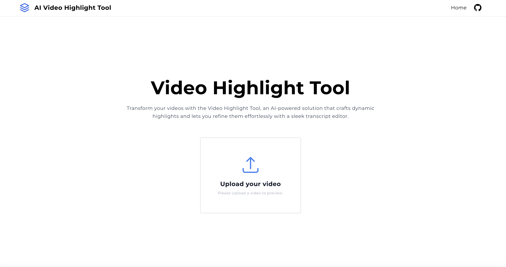

# Video Highlight Tool

This is a web application that allows users to create highlight clips from uploaded videos and add transcripts to these clips.

## Table of Contents

- [Video Highlight Tool](#video-highlight-tool)
  - [Table of Contents](#table-of-contents)
  - [Overview](#overview)
  - [Features](#features)
  - [Technology Stack](#technology-stack)
  - [Installation](#installation)
  - [Usage](#usage)
  - [Deployment](#deployment)
  - [License](#license)

## Overview

The Video Highlight Tool is a web application built using React, Next.js, Tailwind CSS, and React Query. It allows users to upload videos and use AI-powered transcription and highlight detection to create engaging highlight reels.

## Features

- Video upload and processing
- Transcript display with section titles and selectable sentences
- Synchronized video playback and transcript highlighting
- Highlight timeline for quick navigation
- Transcript overlay on the video
- Responsive design for desktop and mobile

## Technology Stack

- **Frontend**: React, Next.js, Tailwind CSS
- **State Management**: Zustand
- **async state management**: React Query
- **API**: Next.js API routes
- **Hosting**: Vercel

## Installation

1. Clone the repository: `git clone https://github.com/your-username/video-highlight-tool.git`
2. Navigate to the project directory: `cd video-highlight-tool`
3. Install dependencies: `npm install`
4. Start the development server: `npm run dev`

## Usage

1. Visit the application in your browser at `http://localhost:3000`
2. Click the "Upload Video" button to add a video file
3. Wait for the AI processing to complete (Mock)
4. Select the sentences you want to include in the highlight reel
5. Preview the highlight clip and adjust as needed

## Deployment

The application is deployed on Vercel. 
You can access the live demo at: [https://video-highlight-tool.vercel.app/](https://video-highlight-tool.vercel.app/)

## License

This project is licensed under the [MIT License](LICENSE).